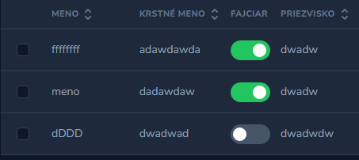

# Laravel Nova Index Toggle Field



## Installation

``` php
composer require wamesk/laravel-nova-boolean-field
```

## Usage
``` php
IndexToggle::make('fajciar', 'smoker'),
```

You must add to required fields !
``` php
->updateRules('sometimes')
```

#### Field options
``` php
->flash('aktualizovaný')
```
